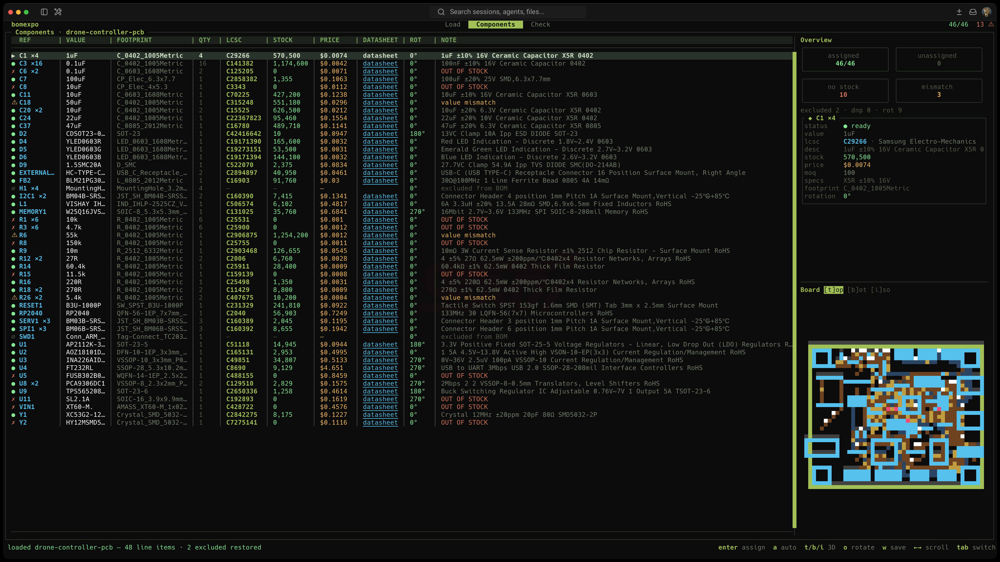
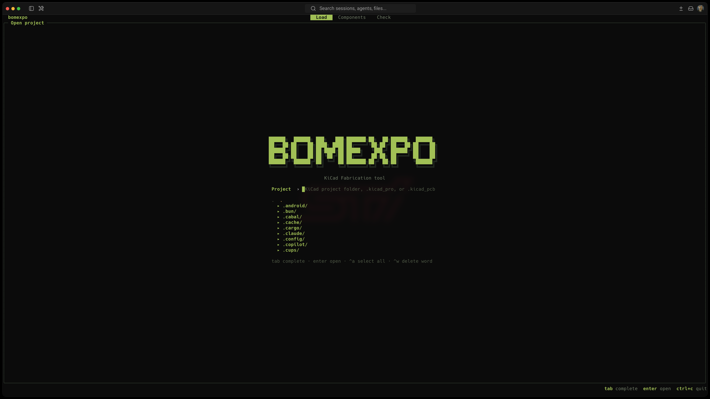
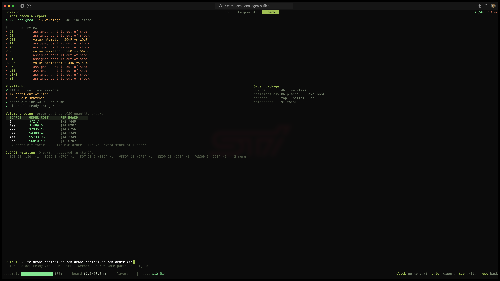

# bomexpo

  [](https://github.com/antaresrvish/homebrew-tap)  

Turn a KiCad board into a JLCPCB assembly order from the terminal. Point bomexpo at a
`.kicad_pcb`, assign an LCSC part to each component, and export the BOM, CPL and Gerbers
as one order-ready zip.

Everything comes from the `.kicad_pcb` itself — components, values, placements and the
board outline.



## Install

Homebrew:

```sh
brew tap antaresrvish/tap
brew trust antaresrvish/tap
brew install bomexpo
```

Homebrew 6 won't load a formula from a third-party tap until you trust it — that's the
`brew trust` line, and it's a one-time step.

Arch (AUR):

```sh
yay -S bomexpo-bin
```

Otherwise grab a binary from the [releases page](https://github.com/antaresrvish/bomexpo/releases).
A winget package is in review.

## Usage

```sh
bomexpo path/to/board.kicad_pcb
# a project folder or .kicad_pro works too
bomexpo ~/designs/drone
```


Components start unassigned. Search LCSC to pick a part, or press `a` to auto-assign by
value, package and type. As you move through the table, the side panel shows the selected
part's stock, price and specs next to a live board preview. Once everything is assigned
and in stock, the Check tab writes the zip you upload to JLCPCB.

Common keys: `enter` assign · `a` auto-assign · `o` cycle rotation override · `x` exclude
· `w` write LCSC codes back to the pcb · `t`/`b`/`i` open a 3D render · `r` refresh stock.


## What it does

- Live LCSC stock, unit price and volume pricing per part.
- Auto-assign that matches value, package, tolerance, voltage and dielectric, and skips
  out-of-stock parts.
- Footprint rotation corrected for JLCPCB's pick-and-place, with a per-part override you
  can save.
- Honours KiCad DNP and exclude-from-BOM flags, and warns when an assigned value drifts
  from the schematic.
- Writes assignments back into the `.kicad_pcb`, so they persist and travel with the
  design in git.
- Exports BOM + CPL + Gerbers in a single zip.

Gerber/CPL export and the 3D render use `kicad-cli`, which ships with KiCad.

## Images




## Build from source

```sh
go build -o bomexpo .
```

## License

MIT — see [LICENSE](LICENSE).
