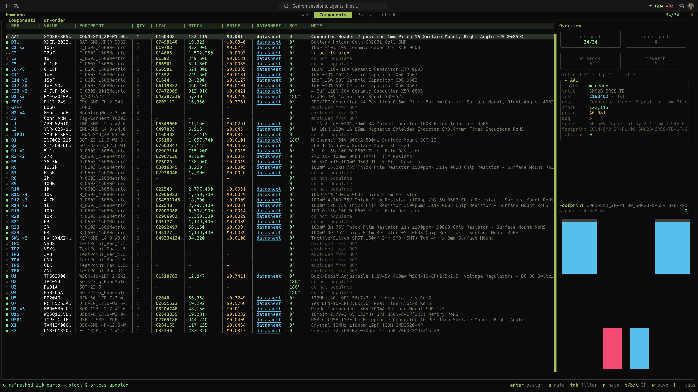
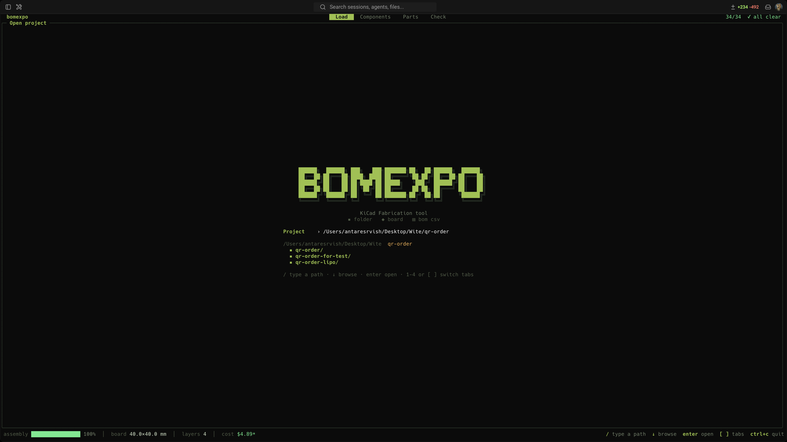
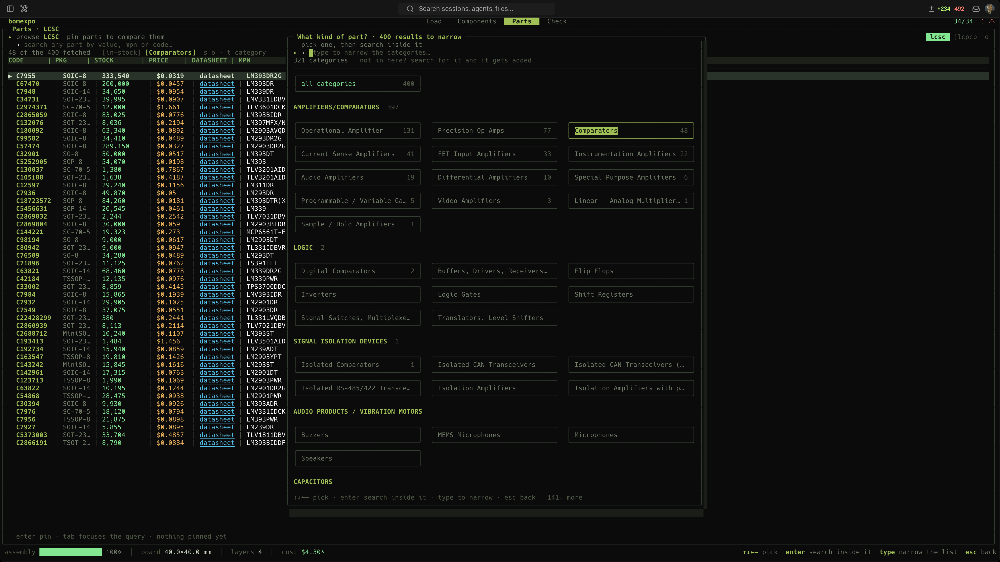
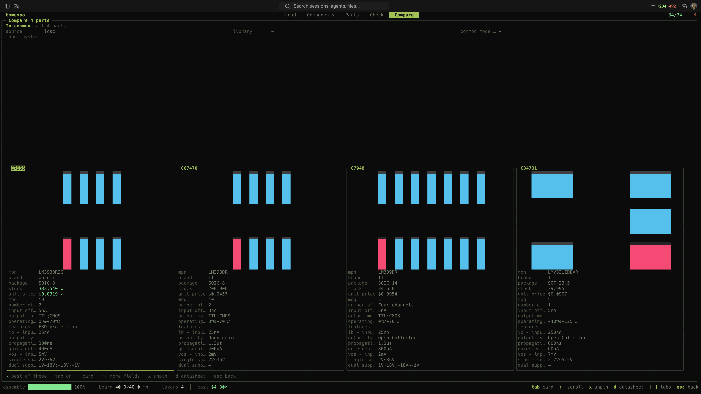
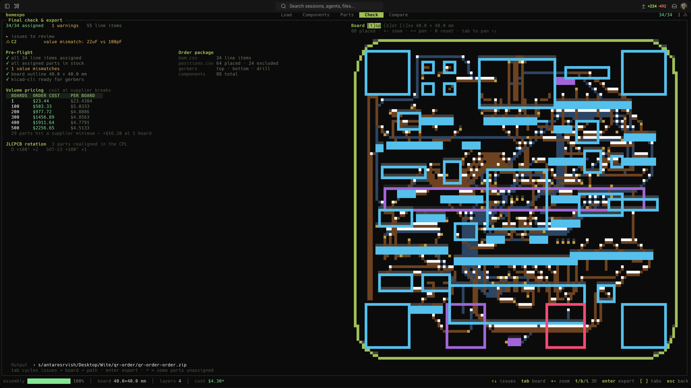

# bomexpo

  [](https://github.com/antaresrvish/homebrew-tap)  

Pick parts and place an order without leaving the terminal. Point bomexpo at a
`.kicad_pcb` and it reads the components, values, placements, nets and board outline
straight out of the file — then you assign an LCSC or JLCPCB part to each one and export
the BOM, CPL and Gerbers as a single order-ready zip.

It also works without a board: hand it a BOM csv and you get the same table, and the
Parts tab searches and compares parts whether or not a design is open.



## Install

Homebrew:

```sh
brew tap antaresrvish/tap
brew trust antaresrvish/tap
brew install bomexpo
```

Homebrew 6 won't load a formula from a third-party tap until you trust it — that's the
`brew trust` line, and it's a one-time step.

Arch (AUR):

```sh
yay -S bomexpo-bin
```

Otherwise grab a binary from the [releases page](https://github.com/antaresrvish/bomexpo/releases).
A winget package is in review.

## Usage

```sh
bomexpo path/to/board.kicad_pcb
# a project folder or .kicad_pro works too
bomexpo ~/designs/drone
# a plain BOM csv, with the placement csv if you have one
bomexpo bom.csv positions.csv
```

The tabs are the job in order: **Load** opens a design, **Components** is where you assign
parts, **Export** writes the zip. **Parts** sits between them as a research tool — browse and
compare parts with or without a design open. When a stage has nothing left to do the status
line names the next one.

Two things hang off a tab rather than taking a number of their own: `c` in Parts compares
pinned parts, and `v` in Export verifies a BOM against the design.



Components start unassigned. Search for a part, or press `a` to auto-assign by value,
package and type. As you move through the table the side panel shows the selected part's
stock, price and specs next to its footprint. Once everything is assigned and in stock, Export
writes the zip you upload.

Exporting a board with open issues asks first, and the question lists them — a part with
nothing assigned will simply be missing from the BOM, and that is worth reading before you
agree to it. A clean board exports without the interruption.

In Export, the parts-cost table is computed rather than fixed: it lists the board counts
where the price per board actually changes, and says which part changes there — a part used
four times per board crosses its 100-piece break at 25 boards, not 100. `q` sets the number
you're really ordering and the table marks it. `enter` on an issue opens that part in
Components.

Those are **part costs only**. The bare board, the stencil, SMT setup, extended-part fees,
panel rails and shipping are the assembler's to quote, so their invoice will be higher —
on a recent 350-board run, $4.94 a board in parts against $5.90 quoted.

Common keys: `enter` assign · `a` auto-assign · `o` cycle rotation override · `x` exclude
· `w` write LCSC codes back to the pcb · `t`/`b`/`i` open a 3D render · `r` refresh stock
· `n` filter by net · `tab` filter the table.

### Two sources

LCSC and JLCPCB both work with no API key. `o` switches between them, `-source jlcpcb`
picks one at startup, and `default_source` in `config.json` makes it stick — under
`~/.config/bomexpo` on Linux, `~/Library/Application Support/bomexpo` on macOS.

They answer different questions. LCSC is the shop: stock and price for buying parts
yourself. JLCPCB is the assembler: it says whether a part is in their basic library or
costs a per-part setup fee, and Check totals that up before you commit.

### Filtering the table

`tab` opens the query and it completes itself — type nothing and it offers the keys, type
`net:` and it offers the board's own nets with how many line items each would show.

```
net:GND          on that net
ref:C1  val:100nF  fp:0402  lcsc:C1525
lib:basic        assembly library standing
st:unassigned    line-item state
0402             bare text: reference, value or footprint
-st:excluded     leading minus inverts the term
```

Terms are ANDed. Whatever survives lights up on the board next to the table, so a net
filter is also a way to see where that net actually goes.

### Parts and compare



Reaching for the search in Parts opens a popup first: *what kind of part?* Every category
the source knows, boxed and grouped, with its own input for narrowing the list. Pick one
and you're searching inside it from then on — `t` reopens it to change your mind. The
category list is crawled from the source and cached for a week, because neither vendor
publishes the taxonomy it labels parts with, nor will search by category. A category it
missed joins the list the first time you search into one.

`p` pins a part, up to four. Pinned parts stay put whatever you search next, and with two of
them `c` opens the comparison: a card each with its footprint on top and every field they
differ on below, the better value brighter.



### Moving around

Whatever has the keyboard is marked with `▸`. A text field keeps every key while it has
focus and `tab` is how you take it back, so a search box never swallows a command. Once a
list has focus the letters are the commands, and `[` `]` or `1`–`5` switch tabs. Arrows
always drive the list either way.

Landing on a tab never takes the keyboard, so the tab keys keep working — press `/` or
`tab` when you want to type. On Load, `↓` walks into the directory listing. On Check the
issue list and the board both want the arrows, so `tab` walks the three panes and `↑↓`
goes to whichever has them.

### Does the part fit the land?

Opening Export asks the vendor for each assigned part's own land pattern and compares it
against the footprint on your board. Two things are faults:

- **more pads than the land offers** — they have nowhere to solder. A land with pads to
  spare is routine, since KiCad footprints carry thermal vias and mounting pads no vendor
  land pattern counts.
- **a part far smaller than its land** — it cannot bridge the pads. Measured over six
  boards, the tightest correct assignment was a part 82% of its land's diagonal (a
  hand-soldering footprint, whose pads are deliberately long); the faults sat at 55% and
  32%, so the line is drawn at 70%.

This catches what nothing else can see. A four-resistor array sold as "27R" passes the value
check, sits in stock, and carries the same part code in the schematic, the board and the BOM,
so Verify calls it agreement — but it has eight pins and an 0402 land offers two. An 0402
capacitor on an 0603 land has two pads either way and the right value. A WLCSP-9 on a
WQFN-14 land has fewer pads than the land, so nothing about the count looks wrong.

In Components the side panel shows both: the land from the board, and under it the pads of
the part meant to sit on it, turned into the same orientation. Vendors publish a footprint in
their own frame — EasyEDA's differs from KiCad's by 90° on eight of this project's packages
and 180° on four — so without that turn a correct assignment reads as the wrong part.

Parts the vendor has no geometry for are counted separately and named, so an incomplete check
never reads as a clean one. `st:footprint` filters the table down to the faults.

### Verify a BOM against the design

`v` in Export lines the same designator up across all three descriptions of the board — the
schematic, the `.kicad_pcb` and a BOM — and reports value, footprint, part code, and
anything present on one side but not another. `m` picks which of the three the other two are
measured against; the board is the default, since that is what gets built.

It answers two questions. Before ordering: does this BOM match the design? After an order
came back wrong: which lines of what I sent were wrong? For the second one you don't need
the old file — every zip bomexpo exports carries its `bom.csv`, so `o` reaches for the last
order beside the project and `O` steps back through older ones.

`enter` on a finding opens that part in Components with the cursor on it, so the thing you
just found is the thing you're about to fix. `r` runs the comparison again.

## What it does

- Live stock, unit price and volume pricing from LCSC or JLCPCB, no API key.
- Auto-assign that matches value, package, tolerance, voltage and dielectric, and skips
  out-of-stock parts.
- Flags parts that aren't in JLCPCB's basic library, since each one adds a setup fee, and
  totals the order at 1 through 500 boards.
- Footprint rotation corrected for JLCPCB's pick-and-place, with a per-part override you
  can save.
- Reads pad nets, so you can filter the table by net and see it highlighted on the board.
- Draws the selected part's footprint, downloading it for parts that aren't on your board.
- Honours KiCad DNP and exclude-from-BOM flags, and warns when an assigned value drifts
  from the schematic.
- Writes assignments back into the `.kicad_pcb`, so they persist and travel with the
  design in git.
- Opens a BOM csv as well as a board, with placements from a csv if you have one.
- Exports BOM + CPL + Gerbers in a single zip.



Gerber/CPL export and the 3D render use `kicad-cli`, which ships with KiCad. Everything
else needs nothing but the binary.

## Build from source

```sh
go build -o bomexpo .
```

## License

MIT — see [LICENSE](LICENSE).
